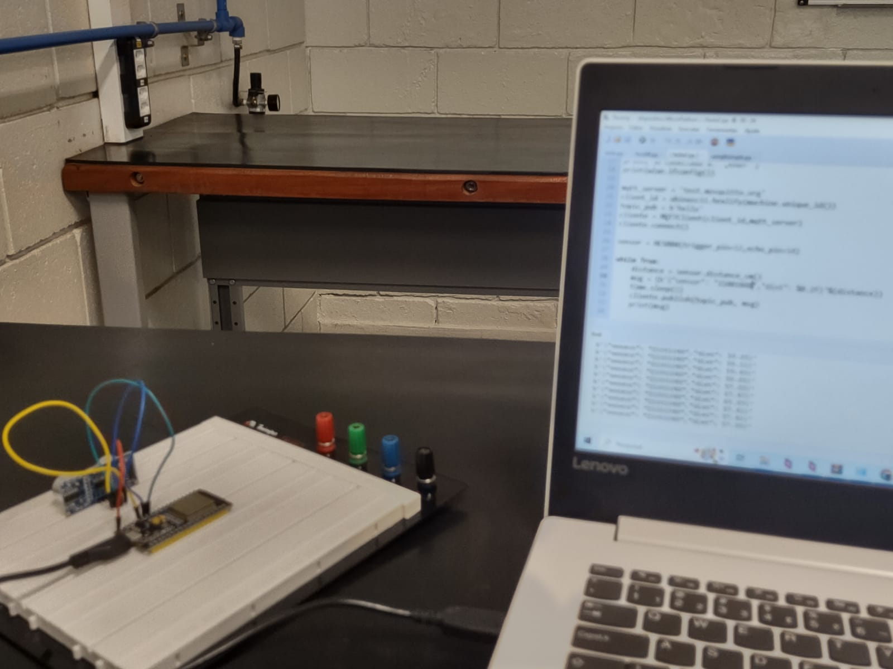

# Mosquitto-MQTT-Signature-Messages

  

  

   
  

> Project developed during the IoT class at PUC-Campinas University. We developed a Mosquitto MQTT Signature Messages.

## Tech Stack

- **[MicroPython](https://micropython.org/)**
- **[Wokwi](https://wokwi.com/)**
- **[Mosquitto](https://mosquitto.org/)**
- **[Python for ESP32](https://github.com/espressif/arduino-esp32)**

---

## 👨‍💼 Author

<table>
  <tr>
    <td align="center">
      <a href="#">
         
        
          <b>Gian Dutra</b>
        
      </a>
    </td>
  </tr>
</table>
